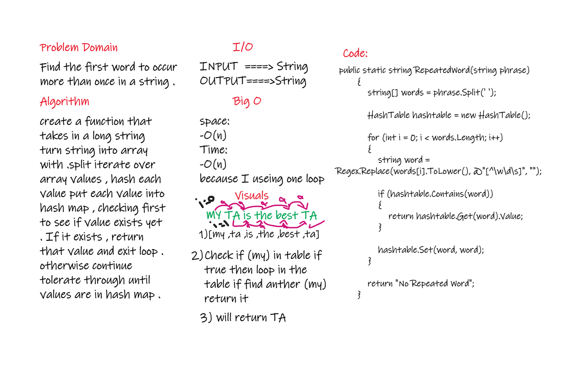
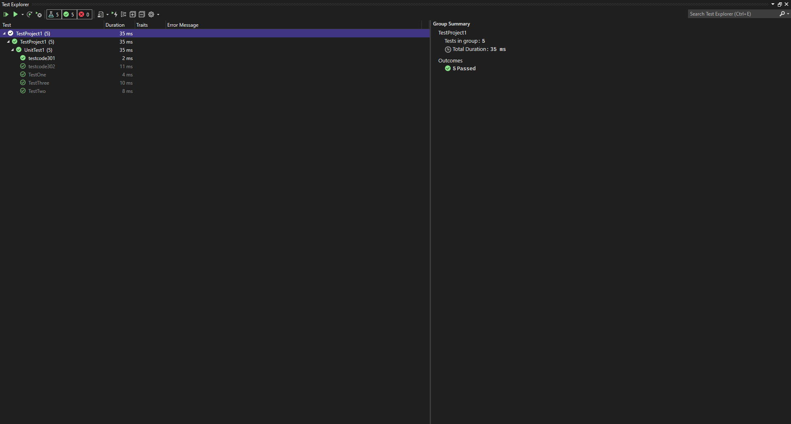
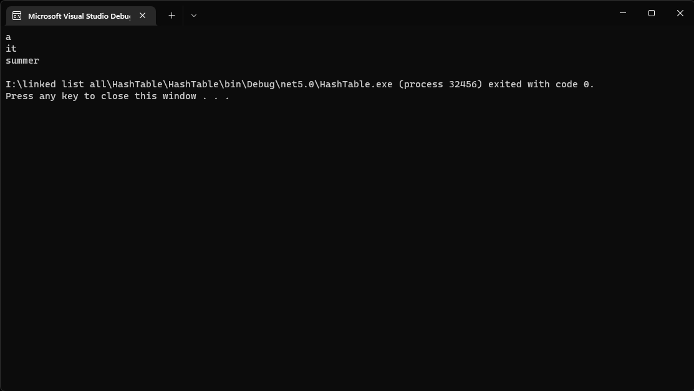

# Challenge Summary
Write a function called repeated word that finds the first word to occur more than once in a string

## Whiteboard Process

## Approach & Efficiency
<!-- What approach did you take? Why? What is the Big O space/time for this approach? -->
Big O for Time is O(n), Space is O(n)
it o(n)
 i use one for loop
 i use one for loop
 i use one for loop
## Solution
<!-- Show how to run your code, and examples of it in action -->

