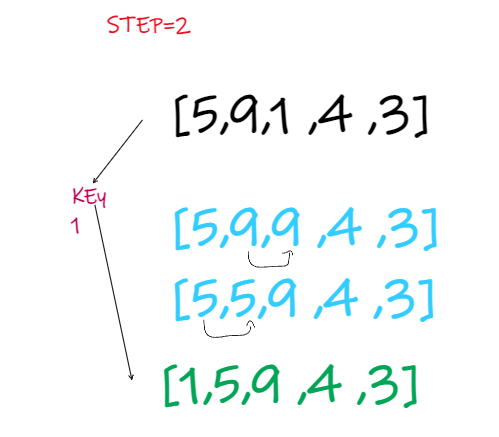

# Insertion Sort

Insertion sort is a simple sorting algorithm that works similar to the way you sort playing cards in your hands. The array is virtually split into a sorted and an unsorted part. Values from the unsorted part are picked and placed at the correct position in the sorted part.

## Pseudocode
InsertionSort(int[] arr)

    FOR i = 1 to arr.length

      int j <-- i - 1
      int temp <-- arr[i]

      WHILE j >= 0 AND temp < arr[j]
        arr[j + 1] <-- arr[j]
        j <-- j - 1

      arr[j + 1] <-- temp

## Trace
Suppose we need to sort the following array.

    Initial array

  ### Pass 1:If the first element is greater than key, then key is placed in front of the first element.

  The first element in the array is assumed to be sorted. Take the second element and store it separately in key.

Compare key with the first element. If the first element is greater than key, then key is placed in front of the first element.

 

   

### Pass 2:  Place 1 at the beginning

Now, the first two elements are sorted.

Take the third element and compare it with the elements on the left of it. Placed it just behind the element smaller than it. If there is no element smaller than it, then place it at the beginning of the array.

### Pass 3: Place 4 behind 1

Similarly, place every unsorted element at its correct position.

### Pass 4: Place 3 behind 1 and the array is sorted

## Insertion Sort Algorithm 
Iterate from arr[1] to arr[N] over the array. 
Compare the current element (key) to its predecessor. 
If the key element is smaller than its predecessor, compare it to the elements before. Move the greater elements one position up to make space for the swapped element.

## Efficency

- Time Complexities

	           
| Time Complexity      | ##### |
| ----------- | ----------- |
| Best      | O(n)       |
| Worst   | O(n2)        |
| Average   | O(n2)        |
	

- Worst Case Complexity: O(n2)
Suppose, an array is in ascending order, and you want to sort it in descending order. In this case, worst case complexity occurs.

- Best Case Complexity: O(n)
When the array is already sorted, the outer loop runs for n number of times whereas the inner loop does not run at all. So, there are only n number of comparisons. Thus, complexity is linear.

- Average Case Complexity: O(n2)
It occurs when the elements of an array are in jumbled order (neither ascending nor descending).

- Space Complexity:

Space complexity is O(1) because an extra variable key is used.

## Insertion Sort Applications
- The insertion sort is used when:
 - the array is has a small number of elements
 - there are only a few elements left to be sorted