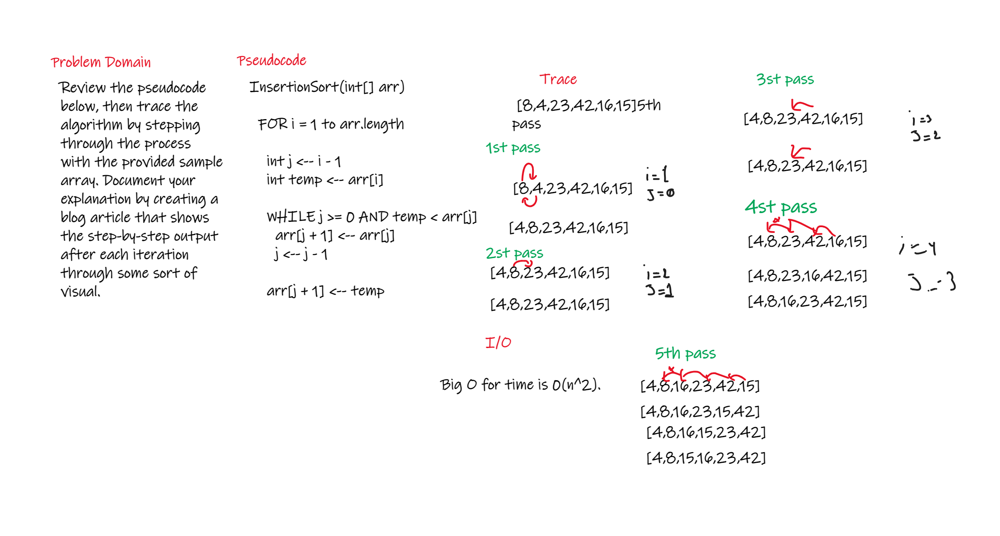
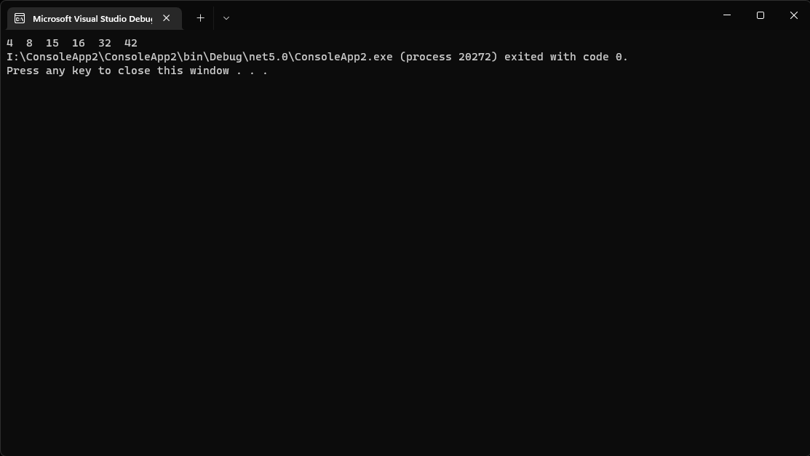

# Challenge Summary
<!-- Description of the challenge -->
Review the pseudocode below, then trace the algorithm by stepping through the process with the provided sample array. Document your explanation by creating a blog article that shows the step-by-step output after each iteration through some sort of visual.
## Whiteboard Process
<!-- Embedded whiteboard image -->


## Approach & Efficiency
<!-- What approach did you take? Why? What is the Big O space/time for this approach? -->
Big O for time is 0(n^2).


## Solution
<!-- Show how to run your code, and examples of it in action -->

```c#
 static void Main(string[] args)
        {

            int[] arr = { 8,4,42,32,16,15};
            InsertionSort(arr);
            for (int i = 0; i < arr.Length; i++)
            {
                Console.Write(arr[i]);
            }
         }
        public static int[] InsertionSort(int[] arr)
        {
            for (int i = 1; i < arr.Length; i++)
            {
                int j = i - 1;
                int temp = arr[i];

                while (j >= 0 && temp < arr[j])
                {
                    arr[j + 1] = arr[j];
                    j -= 1;
                }

                arr[j + 1] = temp;
            }

            return arr;
        }
    }
    ```


    