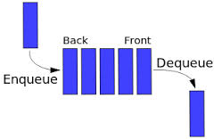

# Stacks and Queues
Overview
## Stack:
In the pushdown stacks only two operations are allowed: push the item into the stack, and pop the item out of the stack. A stack is a limited access data structure - elements can be added and removed from the stack only at the top. push adds an item to the top of the stack, pop removes the item from the top. A helpful analogy is to think of a stack of books; you can remove only the top book, also you can add a new book on the top.

## Queue:
An excellent example of a queue is a line of students in the food court of the UC. New additions to a line made to the back of the queue, while removal (or serving) happens in the front. In the queue only two operations are allowed enqueue and dequeue. Enqueue means to insert an item into the back of the queue, dequeue means removing the front item. The picture demonstrates the FIFO access. The difference between stacks and queues is in removing. In a stack we remove the item the most recently added; in a queue, we remove the item the least recently added.

## Challenge
<!-- Description of the challenge -->
## Node
- Create a Node class that has properties for the value stored in the Node, and a pointer to the next node.
## Stack
  - Create a Stack class that has a top property. It creates an empty Stack when instantiated.
   - This object should be aware of a default empty value assigned to top when the stack is created.
   - The class should contain the following methods:
   - push
   - pop
   - peek
   - is empty

## Queue
- Create a Queue class that has a front property. It creates an empty Queue when instantiated.
   - This object should be aware of a default empty value assigned to front when the queue is created.
   - The class should contain the following methods:
   - enqueue
   - dequeue
   - peek
   - is empty

## Approach & Efficiency
 1. space complexity is O(1)
 2. time complexity is  a O(1).

## API
<!-- Description of each method publicly available to your Stack and Queue-->
# Stack methods:

- Push:  is used to inserts an object at the top of the Stack
- Pop: is used to remove and returns the object at the top of the Stack.
- Peek: is used to return the object at the top of the Stack without removing it. This method is similar to the Pop method, but Peek does not modify the Stack.
- IsEmpty: returns a boolean indicating whether or not the stack is empty.
# Queue methods:
- Enqueue: This method is used to add an object to the end of the Queue
- Dequeue :method is used to returns the object at the beginning of the Queue
- Peek: returns value of the node located at the front of the queue,This method is similar to the Dequeue method.
- IsEmpty returns a boolean indicating whether or not the queue is empty.