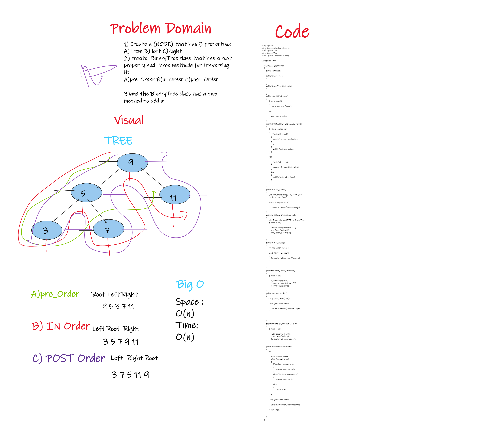

# Trees
<!-- Short summary or background information -->
tree data structure is a non-linear data structure because it does not store in a sequential manner.It is a hierarchical structure as elements in a Tree are arranged in multiple levels. In the Tree data structure, the topmost node is known as a root node. Each node contains some data, and data can be of any type.
## Challenge
<!-- Description of the challenge -->

## Approach & Efficiency
<!-- What approach did you take? Why? What is the Big O space/time for this approach? -->
Big O(n*2h)

## API
<!-- Description of each method publicly available in each of your trees -->
- Add : Adds a new node .
- Contains: Returns boolean indicating whether or not the value is in the tree at least once
- pre order:  ordered root  left right.
- in order:  ordered left  root  right.
- post order: ordered left  right root.
