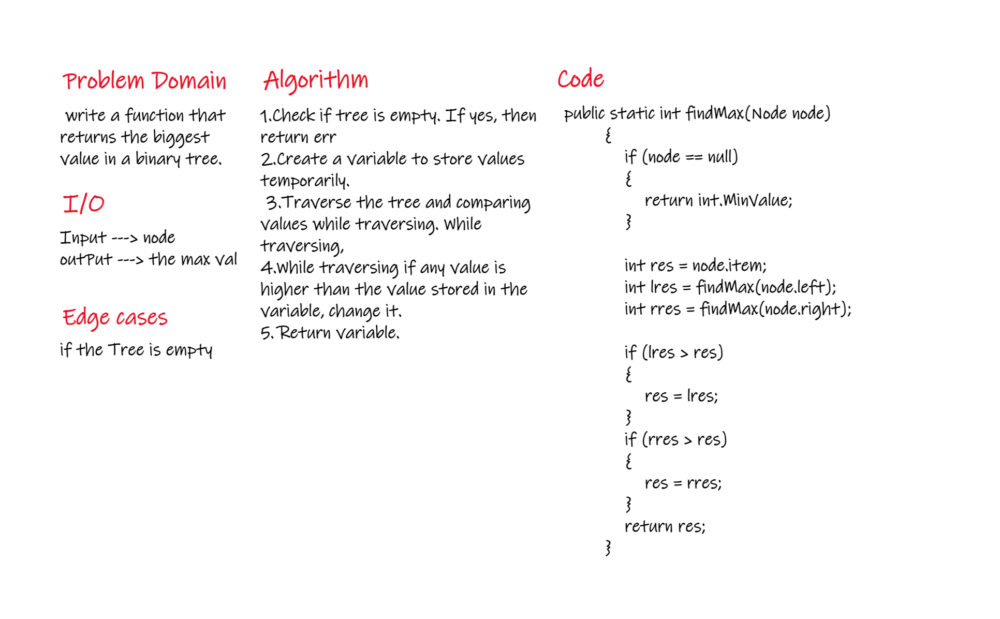
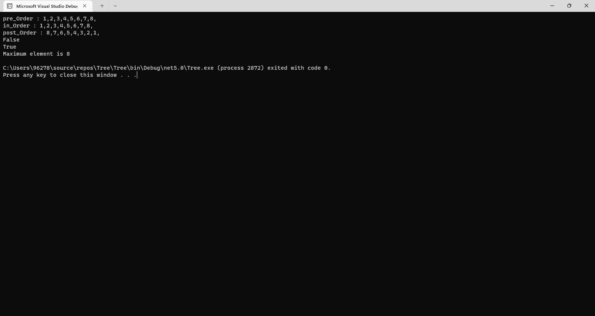

# Challenge Summary
<!-- Description of the challenge -->
Create a function / method that return the biggest value in a tree.

## Whiteboard Process
<!-- Embedded whiteboard image -->

## Approach & Efficiency

- Space :
  - O(1)
- Time :
  - O(n)

## Solution
<!-- Show how to run your code, and examples of it in action -->
