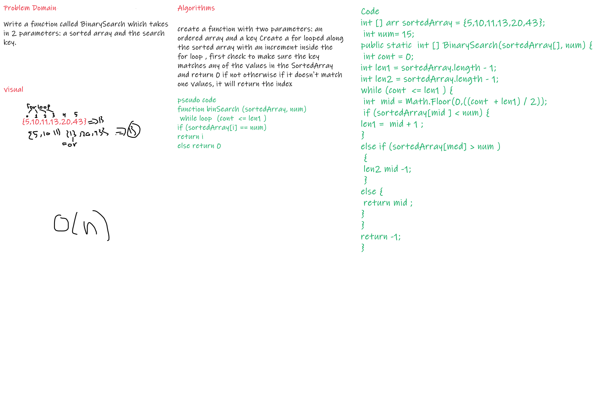

# array-binary-search
# Reverse an Array
Write a function called BinarySearch which takes in 2 parameters: a sorted array and the search key. ## Whiteboard Process

## Approach & Efficiency
Big O  = O(N)
because I use one for loop that means i looped time depended on the array length
### The Output

==============================================
==============================================
==============================================
