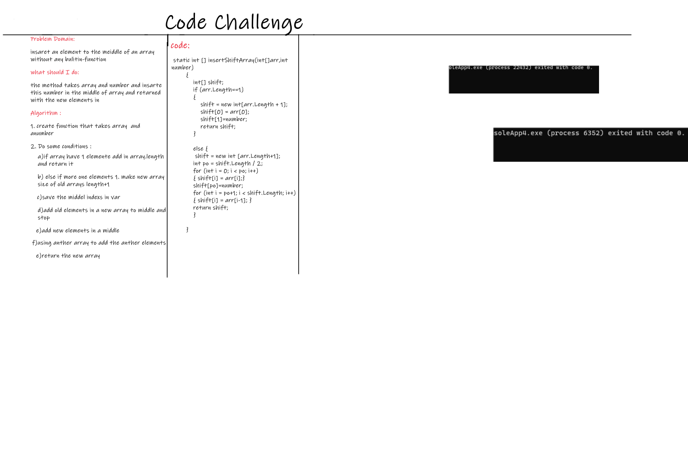

# array-insert-shift
# Insert to Middle of an Array
<!-- Description of the challenge -->
 a function called insertShiftArray which takes in an array and a value to be added.AND return an array with the new value added at the middle index.

## Whiteboard Process
<!-- Embedded whiteboard image -->

## Approach & Efficiency
<!-- What approach did you take? Discuss Why. What is the Big O space/time for this approach? -->
Big O  = O(N*2)
because I use one TOW for loop that means i looped time depended on the array length

