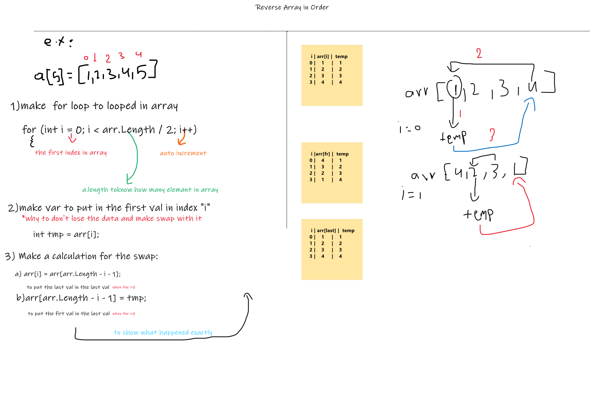

# Reverse an Array
 a function called reverseArray which takes an array as an argument and return an array with elements in reversed order.
## Whiteboard Process

## Approach & Efficiency
Big O  = O(N)
because I use one for loop that means i looped time depended on the array length
### The Output

==============================================
==============================================
==============================================
# array-insert-shift