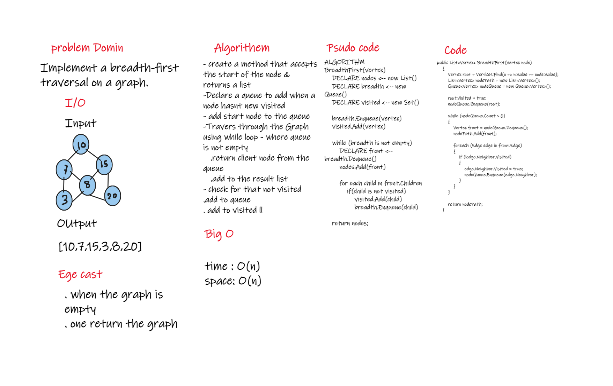

# Challenge Summary
<!-- Description of the challenge -->
Implement a breadth-first traversal on a graph.

## Whiteboard Process
<!-- Embedded whiteboard image -->

## Approach & Efficiency
<!-- What approach did you take? Why? What is the Big O space/time for this approach? -->
Big O Space = O(n)
Big O Time = O(n)
## Solution
<!-- Show how to run your code, and examples of it in action -->

