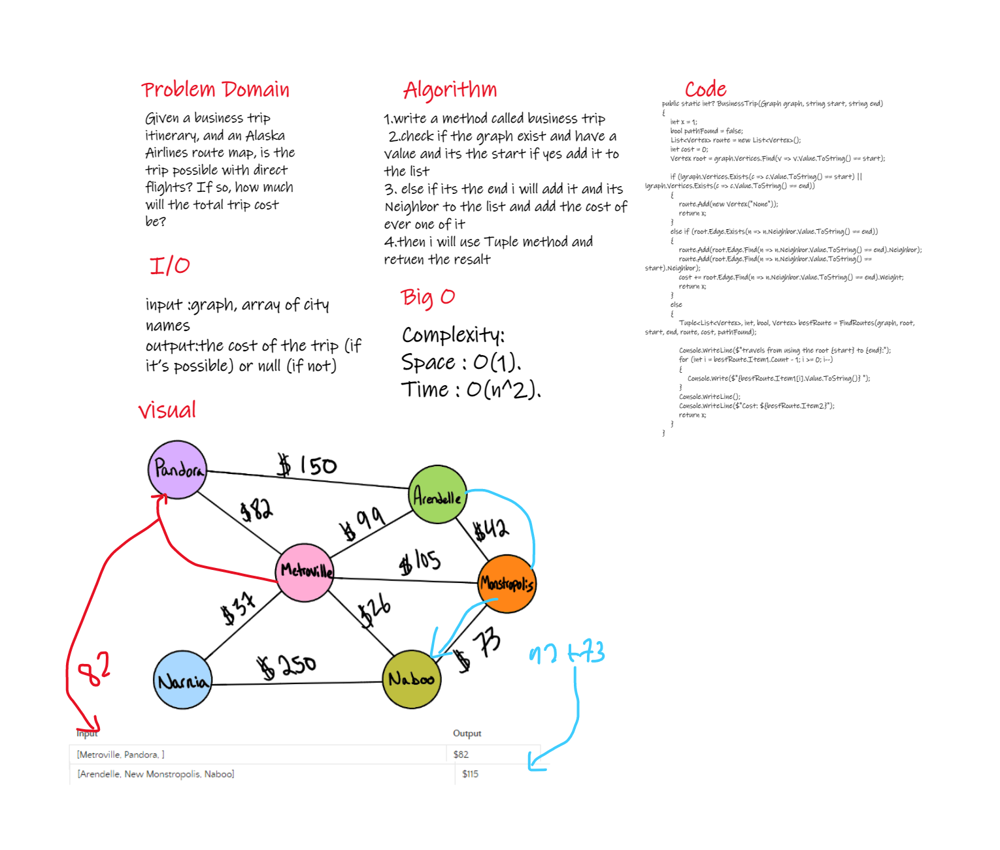

## Challenge Summary
Given a business trip itinerary, and an Alaska Airlines route map, is the trip possible with direct flights? If so, how much will the total trip cost be?
=================================

## Whiteboard Process



=================================

## Approach & Efficiency
Complexity:
Space : O(1).
Time : O(n^2).


==================================

Solution:


```C#
 public static int? BusinessTrip(Graph graph, string start, string end)
        {
            int x = 1;
            bool pathFound = false;
            List<Vertex> route = new List<Vertex>();
            int cost = 0;
            Vertex root = graph.Vertices.Find(v => v.Value.ToString() == start);

            if (!graph.Vertices.Exists(c => c.Value.ToString() == start) || !graph.Vertices.Exists(c => c.Value.ToString() == end))
            {
                route.Add(new Vertex("None"));
                return x;
            }
            else if (root.Edge.Exists(n => n.Neighbor.Value.ToString() == end))
            {
                route.Add(root.Edge.Find(n => n.Neighbor.Value.ToString() == end).Neighbor);
                route.Add(root.Edge.Find(n => n.Neighbor.Value.ToString() == start).Neighbor);
                cost += root.Edge.Find(n => n.Neighbor.Value.ToString() == end).Weight;
                return x;
            }
            else
            {
                Tuple<List<Vertex>, int, bool, Vertex> bestRoute = FindRoutes(graph, root, start, end, route, cost, pathFound);

                Console.WriteLine($"travels from using the root {start} to {end}:");
                for (int i = bestRoute.Item1.Count - 1; i >= 0; i--)
                {
                    Console.Write($"{bestRoute.Item1[i].Value.ToString()} ");
                }
                Console.WriteLine();
                Console.WriteLine($"Cost: ${bestRoute.Item2}");
                return x;
            }
        }
```