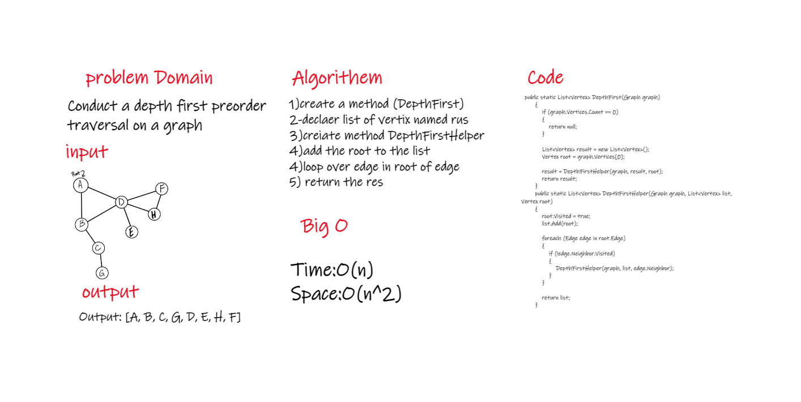

# Depth First Traversal
<!-- Short summary or background information -->
Depth First Search (DFS) algorithm traverses a graph in a depthward motion and uses a stack to remember to get the next vertex to start a search, when a dead end occurs in any iteration.
As in the example given above, DFS algorithm traverses from S to A to D to G to E to B first, then to F and lastly to C. It employs the following rules.

Rule 1 − Visit the adjacent unvisited vertex. Mark it as visited. Display it. Push it in a stack.

Rule 2 − If no adjacent vertex is found, pop up a vertex from the stack. (It will pop up all the vertices from the stack, which do not have adjacent vertices.)

Rule 3 − Repeat Rule 1 and Rule 2 until the stack is empty.
## Challenge
<!-- Description of the challenge -->
Conduct a depth first preorder traversal on a graph

## Approach & Efficiency
<!-- What approach did you take? Why? What is the Big O space/time for this approach? -->
time O(n)
space O(n^2)
## Solution
<!-- Embedded whiteboard image -->

## Requirements
Ensure your complete solution follows the standard requirements.

1. [unit tests](/graph-depth-first/Graph/TestProject1/UnitTest1.cs)
2.  [template for a well-formatted README](1.0.png)
3.  [these instructions](/graph-depth-first/Graph/Graph/Graph.cs)
