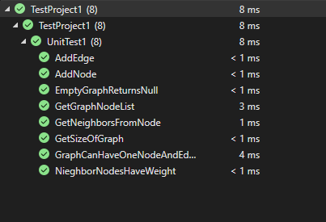

# Graph
A graph is a non-linear data structure that can be looked at as a collection of vertices (or nodes) potentially connected by line segments named edges.

## Challenge
creating a Graph represented as adjacency list and provide the following methods :
- add node:
 - Arguments: value
 - Returns: The added node
 - Add a node to the graph

- add edge:
 - Arguments: 2 nodes to be connected by the edge, weight (optional)
 - Returns: nothing
 - Adds a new edge between two nodes in the graph
 - If specified, assign a weight to the edge
 - Both nodes should already be in the Graph

- get nodes:
 - Arguments: none
 - Returns all of the nodes in the graph as a collection (set, list, or similar)
- get neighbors:
 - Arguments: node
 - Returns a collection of edges connected to the given node
 - Include the weight of the connection in the returned collection
- size:
 - Arguments: none
 - Returns the total number of nodes in the graph

## Approach & Efficiency

I took the implementation path, where I start writing code and tests my result step by step.

### Efficiency
- Time:
 - add node : O(1)
 - add edge : O(1)
 - get nodes : O(n)
 - get neighbors : O(n)
 - size : O(n)

- Space:
- add node : O(n)
- add edge : O(n)
- get nodes : O(n)
- get neighbors : O(n)
- size : O(1)

## API

