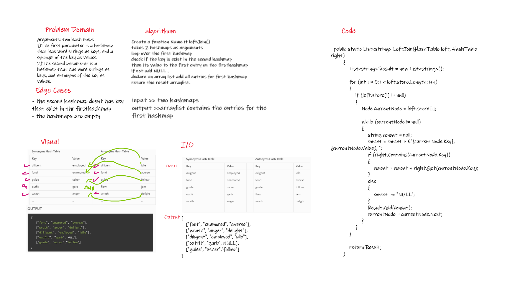

# Challenge Summary
Arguments: two hash maps
1. The first parameter is a hashmap that has word strings as keys, and a synonym of the key as values.
2. The second parameter is a hashmap that has word strings as keys, and antonyms of the key as values.## Whiteboard Process
## Whiteboard Process

## Approach & Efficiency
<!-- What approach did you take? Why? What is the Big O space/time for this approach? -->
Big O Space = O(n)
Big O Time = O(n)
one loop
## Solution
<!-- Show how to run your code, and examples of it in action -->

