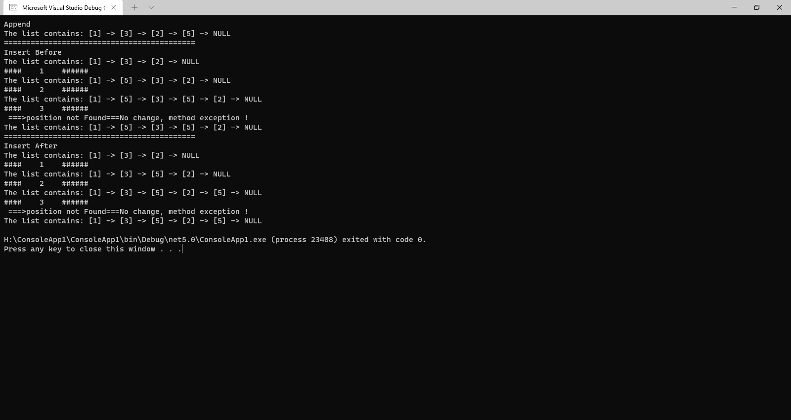

# Challenge Summary
<!-- Description of the challenge -->
make linked list and make mor methed in 
1. adds a new node with the given new value immediately before the first node that has the value specified
2. adds a new node with the given new value immediately after the first node that has the value specified
3. adds a new node with the given value to the end of the list

## Whiteboard Process
<!-- Embedded whiteboard image -->

## Approach & Efficiency
<!-- What approach did you take? Why? What is the Big O space/time for this approach? -->
the BIG O for all O(n)

## Solution
<!-- Show how to run your code, and examples of it in action -->

