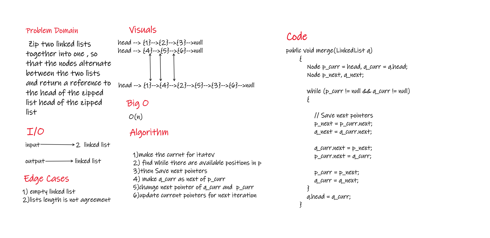
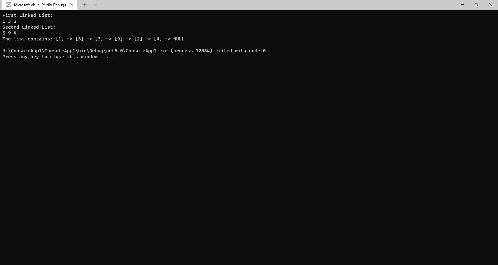

# Challenge Summary
<!-- Description of the challenge -->
Zip the two linked lists together into one so that the nodes alternate between the two lists and return a reference to the the zipped list.

## Whiteboard Process
<!-- Embedded whiteboard image -->

## Approach & Efficiency
<!-- What approach did you take? Why? What is the Big O space/time for this approach? -->
the BIG O for all O(n)

## Solution
<!-- Show how to run your code, and examples of it in action -->

