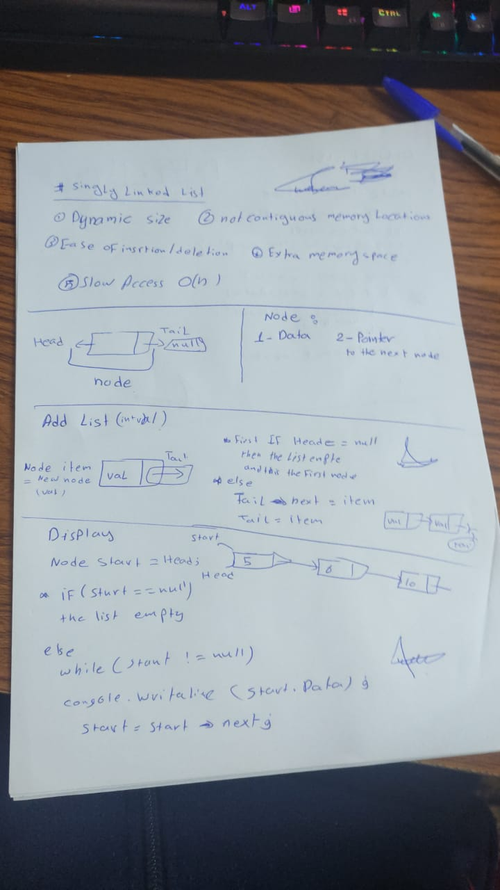
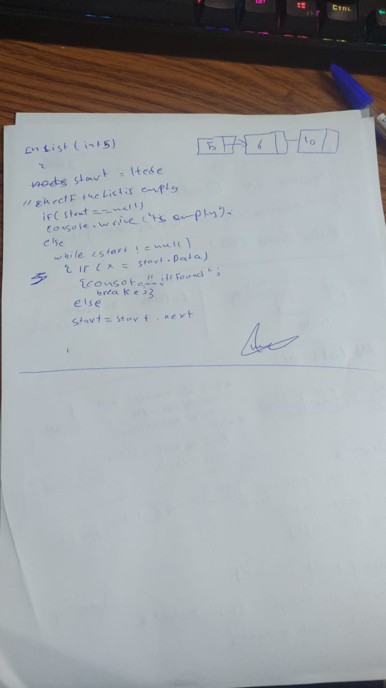
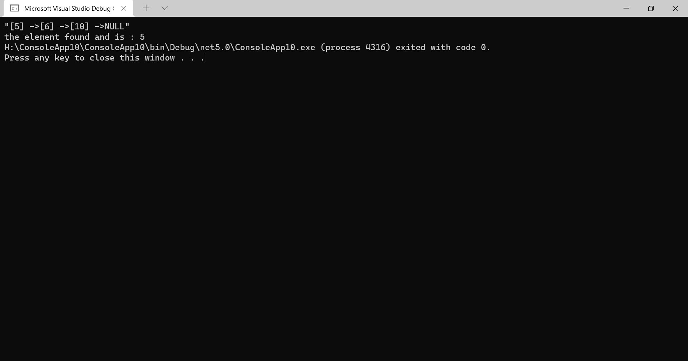

# Singly Linked List
<!-- Short summary or background information -->

## Challenge
1. Create a Linked List class
2. insert in 
3. display
4. looking  in 
## Approach & Efficiency
o(1) for all function
## API

