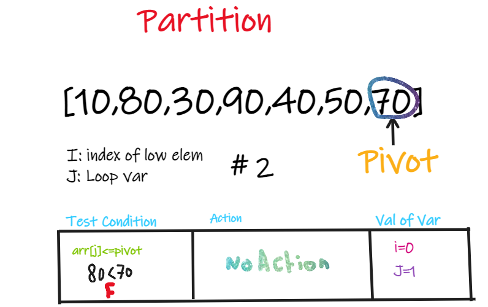

# Quick Sort
QuickSort is a Divide and Conquer algorithm. It picks an element as pivot and partitions the given array around the picked pivot. There are many different versions of quickSort that pick pivot in different ways. 

## Pseudocode
```
ALGORITHM QuickSort(arr, left, right)
    if left < right
        // Partition the array by setting the position of the pivot value
        DEFINE position <-- Partition(arr, left, right)
        // Sort the left
        QuickSort(arr, left, position - 1)
        // Sort the right
        QuickSort(arr, position + 1, right)

ALGORITHM Partition(arr, left, right)
    // set a pivot value as a point of reference
    DEFINE pivot <-- arr[right]
    // create a variable to track the largest index of numbers lower than the defined pivot
    DEFINE low <-- left - 1
    for i <- left to right do
        if arr[i] <= pivot
            low++
            Swap(arr, i, low)

     // place the value of the pivot location in the middle.
     // all numbers smaller than the pivot are on the left, larger on the right.
     Swap(arr, right, low + 1)
    // return the pivot index point
     return low + 1

ALGORITHM Swap(arr, i, low)
    DEFINE temp;
    temp <-- arr[i]
    arr[i] <-- arr[low]
    arr[low] <-- temp
```


## Trace
Sample Array: [10,80,30,90,40,50,70]


  ### Pass 1:
  - Consider: arr[] = {10, 80, 30, 90, 40, 50, 70}
    - Indexes:  0   1   2   3   4   5   6 
    - low = 0, high =  6, pivot = arr[h] = 70
    - Initialize index of smaller element, i = -1 


### Pass 2:
- Traverse elements from j = low to high-1
  - j = 0: Since arr[j] <= pivot, do i++ and swap(arr[i], arr[j])
  - i = 0 
- arr[] = {10, 80, 30, 90, 40, 50, 70} // No change as i and j are same
- j = 1: Since arr[j] > pivot, do nothing



### Pass 3:
- j = 2 : Since arr[j] <= pivot, do i++ and swap(arr[i], arr[j])
- i = 1
- arr[] = {10, 30, 80, 90, 40, 50, 70} // We swap 80 and 30 


### Pass 4:
- j = 3 : Since arr[j] > pivot, do nothing // No change in i and arr[]
- j = 4 : Since arr[j] <= pivot, do i++ and swap(arr[i], arr[j])
- i = 2
- arr[] = {10, 30, 40, 90, 80, 50, 70} // 80 and 40 Swapped


### Pass 5:
- j = 5 : Since arr[j] <= pivot, do i++ and swap arr[i] with arr[j] 
- i = 3 
- arr[] = {10, 30, 40, 50, 80, 90, 70} // 90 and 50 Swapped 


### Pass 6:
- We come out of loop because j is now equal to high-1.
- Finally we place pivot at correct position by swapping arr[i+1] and arr[high] (or pivot) 
- arr[] = {10, 30, 40, 50, 70, 90, 80} // 80 and 70 Swapped 


### Pass 7:
- Now 70 is at its correct place. All elements smaller than 70 are before it and all elements greater than 70 are after it.
- Since quick sort is a recursive function, we call the partition function again at left and right partitions


### Pass 8:
- Again call function at right part and swap 80 and 90


## Efficency

O(log n)
