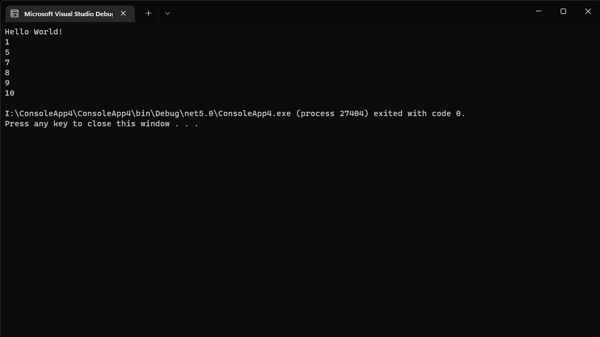
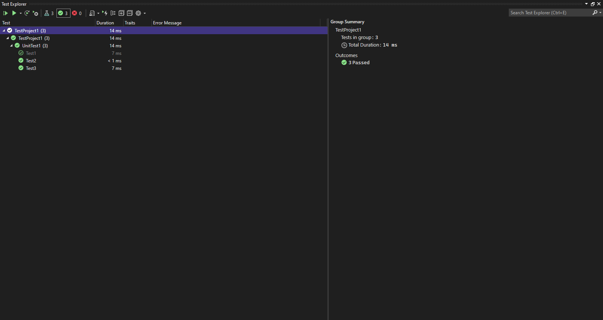

# Challenge Summary
<!-- Description of the challenge -->
QuickSort is a Divide and Conquer algorithm. It picks an element as pivot and partitions the given array around the picked pivot. There are many different versions of quickSort that pick pivot in different ways. 

## Whiteboard Process

## Approach & Efficiency
<!-- What approach did you take? Why? What is the Big O space/time for this approach? -->
O(log n)
## Solution
<!-- Show how to run your code, and examples of it in action -->

