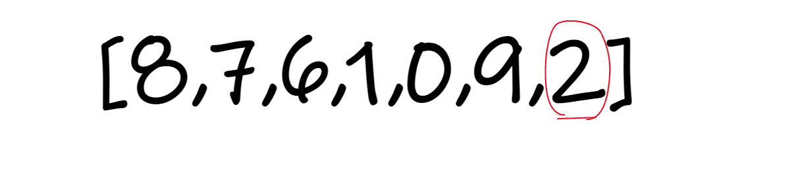
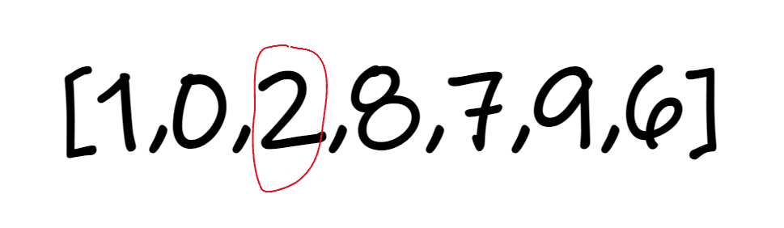
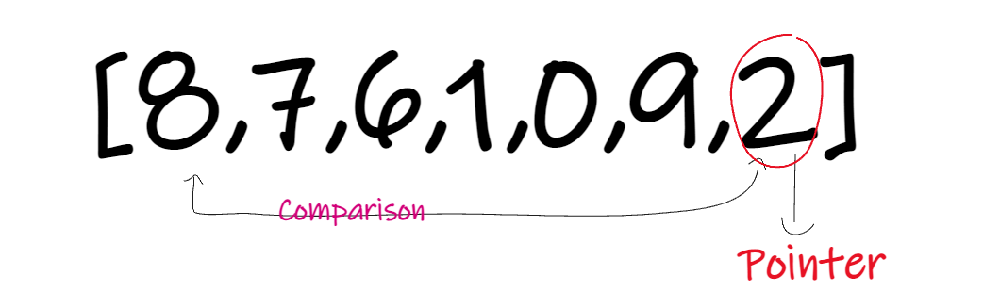
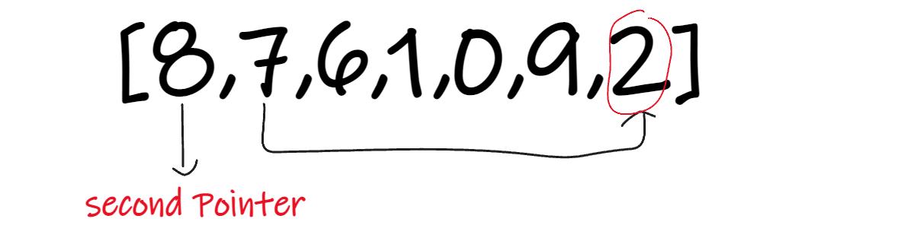
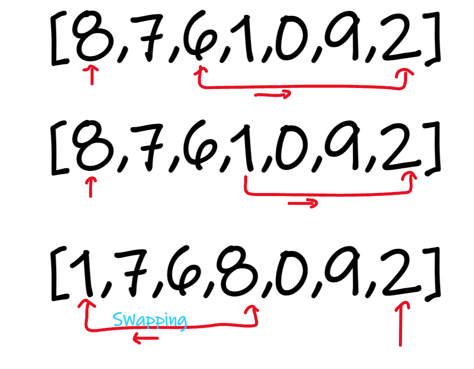
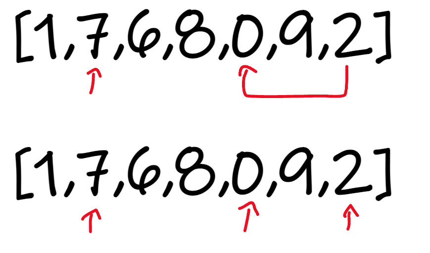
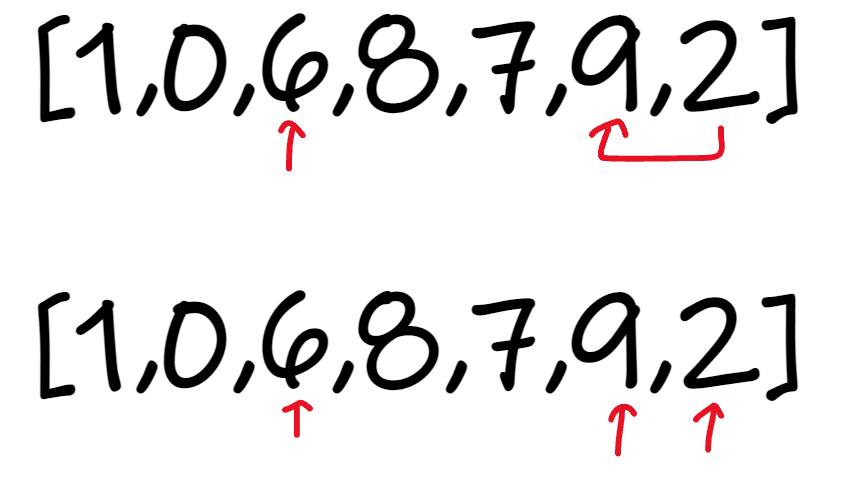
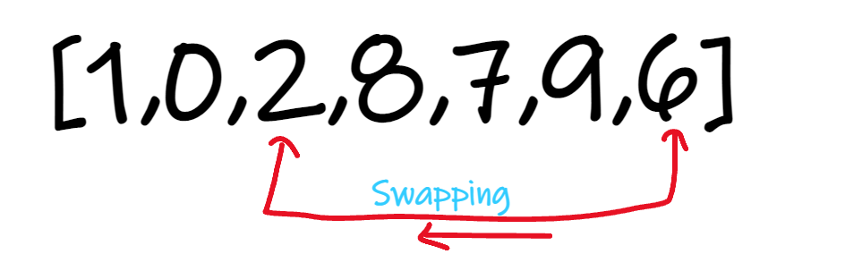
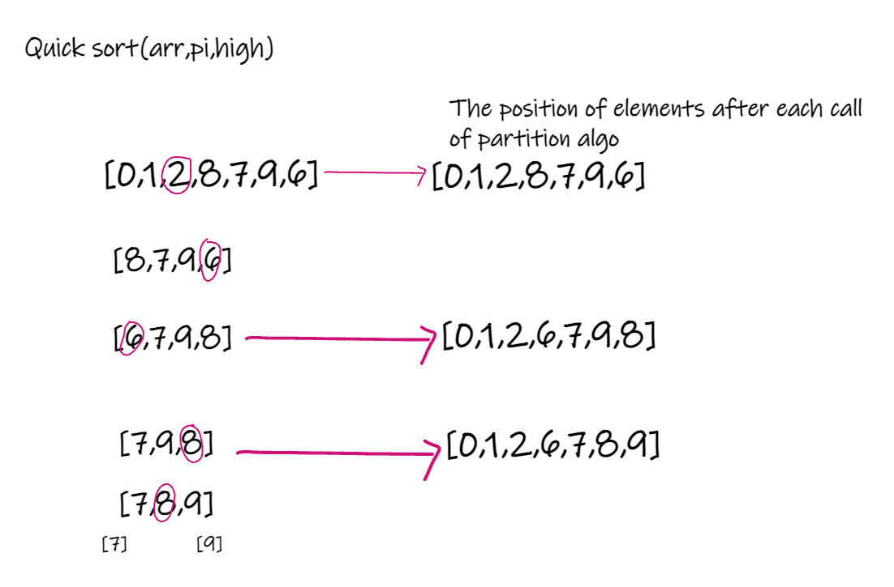

# Quicksort Algorithm
Quicksort is a sorting algorithm based on the divide and conquer approach where

1. An array is divided into subarrays by selecting a pivot element (element selected from the array).
    - While dividing the array, the pivot element should be positioned in such a way that elements less than pivot are kept on the left side and elements greater than pivot are on the right side of the pivot.

2. The left and right subarrays are also divided using the same approach. This process continues until each subarray contains a single element.
3. At this point, elements are already sorted. Finally, elements are combined to form a sorted array.

## Pseudocode
```c#
ALGORITHM Mergesort(arr)
    DECLARE n <-- arr.length

    if n > 1
      DECLARE mid <-- n/2
      DECLARE left <-- arr[0...mid]
      DECLARE right <-- arr[mid...n]
      // sort the left side
      Mergesort(left)
      // sort the right side
      Mergesort(right)
      // merge the sorted left and right sides together
      Merge(left, right, arr)

ALGORITHM Merge(left, right, arr)
    DECLARE i <-- 0
    DECLARE j <-- 0
    DECLARE k <-- 0

    while i < left.length && j < right.length
        if left[i] <= right[j]
            arr[k] <-- left[i]
            i <-- i + 1
        else
            arr[k] <-- right[j]
            j <-- j + 1

        k <-- k + 1

    if i = left.length
       set remaining entries in arr to remaining values in right
    else
       set remaining entries in arr to remaining values in left#
```
## Trace

1. Select the Pivot Element

There are different variations of quicksort where the pivot element is selected from different positions. Here, we will be selecting the rightmost element of the array as the pivot element.



             Select a pivot element
2. Rearrange the Array

 Now the elements of the array are rearranged so that elements that are smaller than the pivot are put on the left and the elements greater than the pivot are put on the right.

 

       Put all the smaller elements on the left and greater on the right of pivot element


  Here's how we rearrange the array:

  1. A pointer is fixed at the pivot element. The pivot element is compared with the elements beginning from the first index.

  

    Comparison of pivot element with element beginning from the first index


  2. If the element is greater than the pivot element, a second pointer is set for that element.

    

  If the element is greater than the pivot element, a second pointer is set for that element.


  3. Now, pivot is compared with other elements. If an element smaller than the pivot element is reached, the smaller element is swapped with the greater element found earlier.


        
    

    Pivot is compared with other elements.

  4. Again, the process is repeated to set the next greater element as the second pointer. And, swap it with another smaller element.

     

    The process is repeated to set the next greater element as the second pointer.


 5. The process goes on until the second last element is reached.

     

     The process goes on until the second last element is reached.


 6. Finally, the pivot element is swapped with the second pointer.

     

     Finally, the pivot element is swapped with the second pointer.


3. Divide Subarrays

Pivot elements are again chosen for the left and the right sub-parts separately. And, step 2 is repeated.

     


      Select pivot element of in each half and put at correct place using recursion

The subarrays are divided until each subarray is formed of a single element. At this point, the array is already sorted.


## Quicksort Complexity

1. Time Complexities
- Worst Case Complexity [Big-O]: O(n2)
   It occurs when the pivot element picked is either the greatest or the smallest element.
   This condition leads to the case in which the pivot element lies in an extreme end of the sorted array. One sub-array is always empty and another sub-array contains n - 1 elements. Thus, quicksort is called only on this sub-array.

However, the quicksort algorithm has better performance for scattered pivots.

- Best Case Complexity [Big-omega]: O(n*log n)
   It occurs when the pivot element is always the middle element or near to the middle element.

- Average Case Complexity [Big-theta]: O(n*log n)
   It occurs when the above conditions do not occur.


2. Space Complexity
The space complexity for quicksort is O(log n).

## Quicksort Applications
Quicksort algorithm is used when

  - the programming language is good for recursion
  - time complexity matters
  - space complexity matters