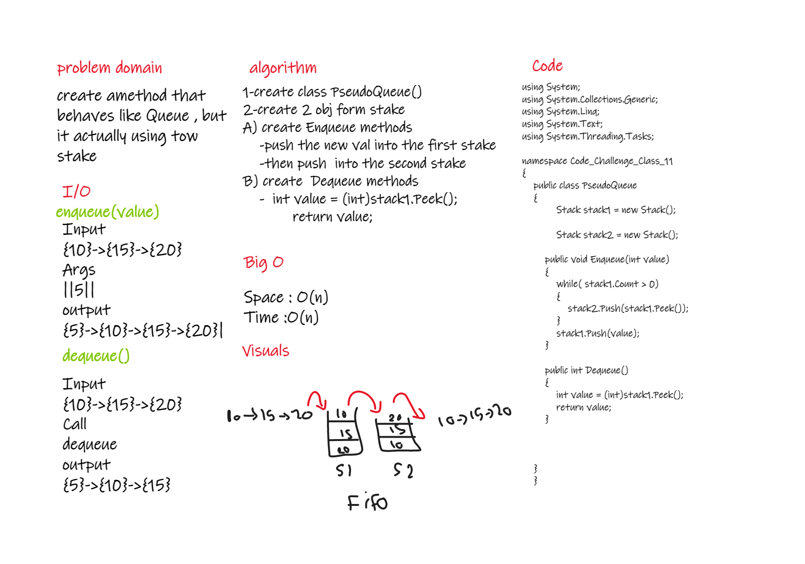

# Challenge Summary
<!-- Description of the challenge -->
make a Queue using 2 Stack 

## Whiteboard Process
<!-- Embedded whiteboard image -->

## Approach & Efficiency
<!-- What approach did you take? Why? What is the Big O space/time for this approach? -->
the BIG O for all O(n)

