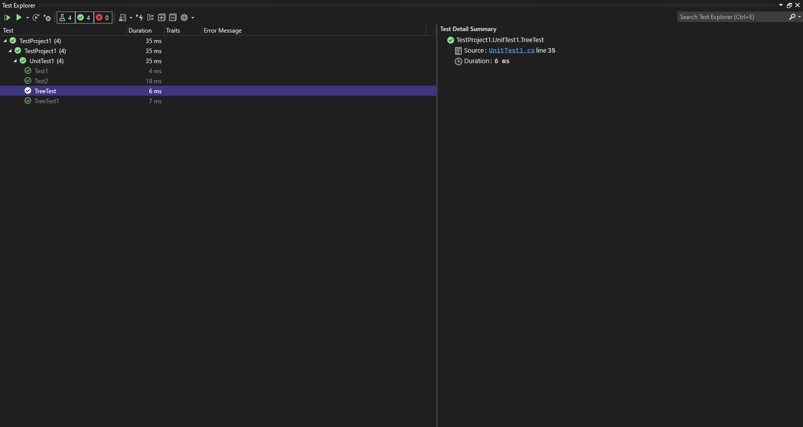

# Challenge Summary
<!-- Description of the challenge -->
Create a function / Return: list of all values in the tree, in the order they were encountered
```
NOTE: Traverse the input tree using a Breadth-first approach
```


## Whiteboard Process
<!-- Embedded whiteboard image -->


## Approach & Efficiency

- Space :
  - O(n*h)
- Time :
  - O(n*h)

## Solution
<!-- Show how to run your code, and examples of it in action -->

